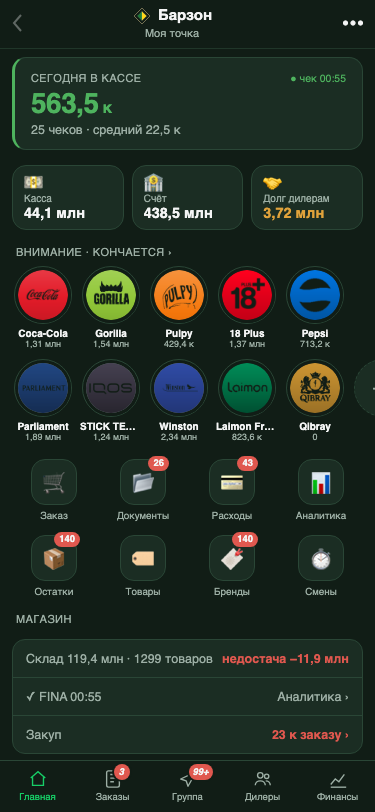
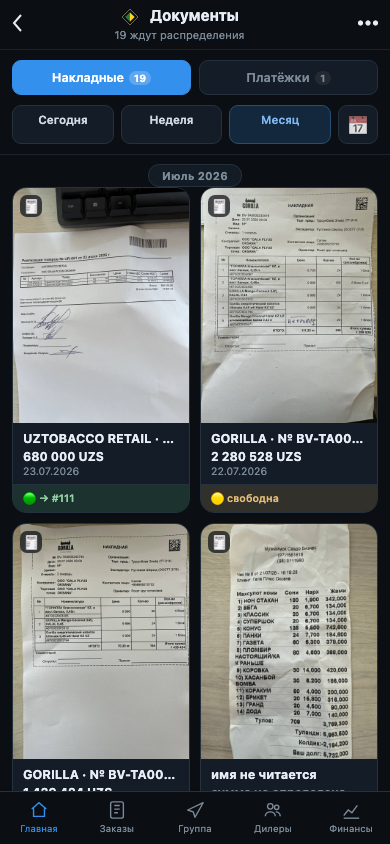
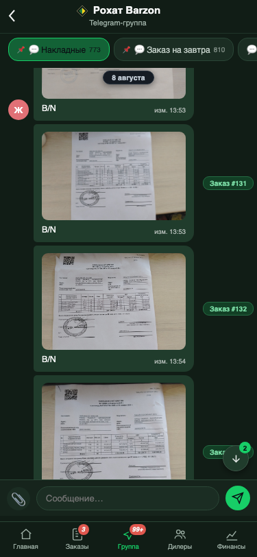

# aibri — витрина кода

**aibri** — это ИИ-помощник владельца магазина, и он узкий по замыслу: читает
бумаги, которые в магазин физически приносят — накладные поставщиков,
фискальные Z-отчёты кассовых смен, платёжные поручения, — сводит их с деньгами
и остатками и там, где не уверен, спрашивает хозяина, а не додумывает сам.

Здесь не весь проект, а витрина — четыре куска кода, по которым можно честно
судить о качестве и об инженерной культуре. Товары и цены в примерах — настоящие:
это наш магазин в Ташкенте, наши поставщики (Borjomi, Kinder, Cheetos и десятки
других позиций с полки), наши дилеры (NDT DISTRIBUTION, GREEN LINE TRADING,
POSITI). В витрину не попадают только ключи, токены и адреса доступа — всё
остальное можно смотреть и трогать.

> Писали вдвоём — я и ИИ — три месяца на живом магазине. Я ставлю задачи и
> принимаю или заворачиваю результат, ИИ пишет код и стражей, каждая волна
> проверяется на настоящих документах и настоящих деньгах. Это не
> демонстрационный стенд: почти каждый комментарий в коде — про ошибку, которая
> уже случилась и стоила денег.

## Как это выглядит живьём

Три экрана прямо из рабочего бота (снято playwright'ом с живого сервера, ничего
не постановочно):

<table>
<tr>
<td width="33%"></td>
<td width="33%"></td>
<td width="33%"></td>
</tr>
<tr>
<td align="center"><sub><b>Пульт</b> — касса, счёт, долг дилерам, остатки</sub></td>
<td align="center"><sub><b>Документы</b> — настоящие фото накладных с приёмки</sub></td>
<td align="center"><sub><b>Группа-зеркало</b> — тот же архив, что и в рабочем Telegram</sub></td>
</tr>
</table>

**Запуск за полминуты** (Python 3.10+, внешних зависимостей у кода нет):

```bash
python3 -m venv .venv && source .venv/bin/activate && pip install -r requirements.txt
pytest                                 # 117 passed, 6 skipped за полсекунды
python -m guards.mutation_control      # ← КОЗЫРЬ: оракул обязан ПАДАТЬ на диверсиях
```

---

## Принцип: узкий ИИ, а не оракул

Всё остальное в проекте держится на одном решении:

**Правила, паттерны и самообучение живут в самом боте. Большая языковая
модель — крайняя инстанция, и деньги она не считает никогда.**

На практике это значит:

- если модель вообще зовут, она отдаёт только дословную транскрипцию текста с
  фотографии — не решает, что приходовать, не выбирает товар, не складывает
  суммы;
- перед любым платным вызовом стоит бесплатный локальный OCR: уверен — вызова
  не будет вовсе;
- всё, что похоже на «знание про поставщиков» — подписи полей, лейблы итога,
  единицы измерения, ставки НДС, маркеры не-накладных, каналы платёжных
  терминалов, — лежит данными в таблице `doc_patterns`. Новый поставщик, новый
  язык бланка, новая подпись поля — это строка в таблицу, а не правка `.py`;
- каждый разбор из любого источника пополняет корпус `doc_corpus` — бот
  становится точнее без правок кода;
- ошибки распознавания снимаются классами (`ll`→`n`, `2`→`z`, кириллические
  близнецы), а не словарём опечаток. Опечаток бесконечно много, классов —
  единицы.

Это дешевле и, что важнее, проверяемо: детерминированный разбор можно накрыть
тестами и мутационным контролем, а «модель посчитала» — нельзя.

---

## Архитектура (схема словами)

```
    фотография документа из рабочего чата
                 │
                 ▼
    ┌─────────────────────────────────┐
    │ 1. СНЯТЬ ТЕКСТ                  │  локальный OCR (macOS Vision) → строки
    │    aibri/recognition/ocr.py     │  документа восстанавливаются по рамкам:
    │    ocr_image()                  │  Vision отдаёт колонки, а нужны СТРОКИ,
    │                                 │  и наклон кадра подбирается, а не
    │                                 │  предполагается
    └───────────────┬─────────────────┘
                    │  дословный текст (кэшируется рядом с фото — читаем один раз)
                    ▼
    ┌─────────────────────────────────┐
    │ 2. ОПОЗНАТЬ ВИД                 │  накладная? Z-отчёт? прайс-лист?
    │    paper_invoice / zreport      │  прайс и заявка на отгрузку в приход НЕ идут
    └───────────────┬─────────────────┘
                    ▼
    ┌─────────────────────────────────┐        ┌──────────────────────────┐
    │ 3. РАЗОБРАТЬ ДЕТЕРМИНИРОВАННО   │◄──────►│ doc_patterns  (правила   │
    │    aibri/recognition/           │        │   ДАННЫМИ, не кодом)     │
    │      paper_invoice.py           │        │ doc_corpus    (память    │
    │    aibri/shifts/zreport.py      │───────►│   каждого разбора)       │
    └───────────────┬─────────────────┘        └──────────────────────────┘
                    │  строки: имя · количество · цена · сумма + ЧЕСТНОСТЬ чтения
                    ▼
    ┌─────────────────────────────────┐
    │ 4. СВЕСТИ С ДЕНЬГАМИ            │  единый формат денег, единый закон допуска,
    │    aibri/money/*                │  счёт дилера, гейт «склад после денег»
    └───────────────┬─────────────────┘
                    ▼
    ┌─────────────────────────────────┐
    │ 5. СКАЗАТЬ ВЛАДЕЛЬЦУ            │  не сошлось → ЧЕСТНЫЙ вопрос, а не
    │    (в витрину не вошёл)         │  «поправим, чтобы красиво»
    └─────────────────────────────────┘

    поперёк всего:  guards/*  — исполняемые правила инженерной культуры
```

Что лежит в витрине:

| путь | что это |
|---|---|
| `aibri/recognition/paper_invoice.py` | парсер бумажных накладных: склейка разорванных денег, якоря строк, отсечение строк-итогов, честность чтения |
| `aibri/recognition/corpus.py` | корпус документов и паттерны: правила данными, свёртка ошибок OCR, закон «правку владельца стереть нельзя» |
| `aibri/recognition/ocr.py` | геометрия страницы: подбор наклона кадра, сборка СТРОК документа из фрагментов, обвязка локального OCR |
| `aibri/recognition/golden.py` | механизм эталонов **с мутационным контролем** |
| `aibri/shifts/zreport.py` | разбор фискальных Z-отчётов (кэш-спутник фото, бесплатный слой перед платным) |
| `aibri/shifts/recon.py` | сверка смены: закон «три расхождения не складываются» |
| `aibri/money/money.py` | единый формат денег на весь проект |
| `aibri/money/tolerance.py` | единый закон допуска расхождений |
| `aibri/money/ledger.py` | счёт дилера «как часы»: было → стало |
| `aibri/money/receiving.py` | гейт «склад двигается только после денег» |
| `guards/` | страж сценария, грепстраж «один смысл = одна реализация», оракул склада, мутационный контроль |
| `fixtures/invoices`, `fixtures/zreports` | накладные и Z-отчёты с настоящими товарами и ценами нашего магазина + построчные эталоны |
| `fixtures/photos/` | три фотографии одной и той же накладной от нашего дилера — бумага «снята» кодом трижды (ровно · под углом · с бликом), а товар и цены на ней настоящие |

---

## Козырь: мутационный контроль эталонов

Самая дорогая ошибка в проекте была не в парсере, а в том, чем мы этот парсер
мерили.

Долго качество разбора накладных мерили метрикой «доля строк, где количество ×
цена = сумма». Метрика держалась около 80 % и выглядела строгой. На деле она не
значила ничего: у строки три числа, любое можно ВЫЧИСЛИТЬ из двух других — и
разные ветки разбора именно так и делали (`цена = сумма / количество`,
`количество = сумма / цена`). Равенство становилось тождественным. Хуже: когда
парсер портился и начинал вычислять больше чисел, метрика росла.

Проверили на рабочем корпусе — среди строк с «зелёной» самопроверкой честно
прочитанных было 29 %. Меньше трети.

Отсюда два механизма, вокруг которых и построена эта витрина.

**Честная метрика.** Строка считается прочитанной (`read=True`), только если
количество и сумма физически напечатаны на одной строке документа
(`paper_invoice.line_read`). Цена законно выводится из суммы-с-НДС и в судью не
входит. Тай-брейк диспетчера разбора считает именно эти строки, а не «зелёные».

**Мутационный контроль.** Оракул эталонов обязан ПАДАТЬ на подложенных ошибках:

- `div10` — все цены и суммы в десять раз меньше (потеря разряда);
- `qty1` — количество +1 на каждой строке, цена пересчитана так, что
  тавтологическая самопроверка остаётся зелёной.

Диверсия применяется к результату разбора, парсер не патчится. Скрипт
`guards/mutation_control.py` доказывает обе стороны сразу, вживую:

```
$ python -m guards.mutation_control
  корпус: документов 8 · разобрано 7 · строк 18 · ok_lines 18 (слабая) · ok_read 18 (честная) · Σ строк = печатный итог 5 из 6
  диверсия «все цены и суммы ÷ 10»: ok_lines 18 (было 18) · ok_read 0 (было 18) · эталоны «= бумага» 0 (было 18)
  диверсия «qty +1 на каждой строке (цена пересчитана, ok сохранён)»: ok_lines 18 (было 18) · ok_read 3 (было 18) · эталоны «= бумага» 0 (было 18)
```

Слабая метрика (`ok_lines`) на обеих диверсиях не шелохнулась — вот почему она
не может быть судьёй. Честная (`ok_read`) и построчные эталоны рухнули — значит,
они видят настоящую ошибку, а их зелёный цвет что-то значит.

Оракул, который не падает на подложенной ошибке, — не оракул. Он стоит дороже,
чем его отсутствие, потому что создаёт уверенность там, где её нет.

И последнее, что делает механизм честным: документы, которые бот сегодня читает
неполно, лежат в эталонах честно-красными. Строка остаётся с ожидаемым значением
бумаги, оракул печатает её как ДОЛГ и не даёт числу совпадений уменьшиться:

```
  🔴 ДОЛГ inv_07_lost_line №2 «Pepsi 0.25L JB» — СТРОКИ НЕТ В РАЗБОРЕ; бумага: 12 × 5000 = 60000
```

Такую строку нельзя «замести»: печатный итог не сходится с суммой строк, и это
жёсткий повод — вопрос владельцу, а не тихое округление.

Гейта у эталонов два, и оба монотонные: число строк «= бумага» и размер самого
корпуса эталонов. Второй нужен потому, что первый иначе выполняется удалением
неудобной строки — совпадений не убавится, убавится знаменатель.

---

## Законы проекта

У проекта есть реестр законов. Закон — это карточка: моя дословная фраза, все
места кода, где закон действует, и страж класса. Правило фикса простое: любая
правка обязана назвать закон и пройти по ВСЕМ местам карточки, а не только по
багованному. Причина этому правилу — моя же собственная реплика:

> «ошибки всегда те же, которые мы исправляли, только дали неправильную
> формулировку»

Семь самых говорящих (в витрине живут все семь):

**L-04v2 · один закон допуска.** Допуск разделяет РАЗНЫЕ вопросы и не смешивает
их: судья разбора (копейки, жёстко) и вердикт владельцу (гасит только
объяснённое округление). Процентный допуск как судья запрещён: на документе с
итогом 1 396 350 сум 0,1 % — это 1 396 сум, и обрезанный разбор без строки на
1 350 сум «сходится» с печатным итогом и побеждает полный. Это не рассуждение —
фикстура `inv_08_percent_judge` устроена ровно так, и тест
`test_процентный_судья_ломает_выбор_разбора` ослабляет судью до процента и
показывает, как выигрывает разбор, потерявший строку. Дом у допуска один — там
же лежат и построчные пороги парсера, и гейт денег приёмки. →
`aibri/money/tolerance.py`

**L-09 · довоз не ест свой хвост.** Плашка «довезли следующей накладной»
предлагала закрыть долг, который создала эта же приёмка — нажатие задвоило бы
приход. Лечится не в интерфейсе, а параметром, которым приёмка исключает свой
собственный заказ. → `aibri/money/ledger.py::open_debt_goods_for_products`

**L-11 · счёт дилера как часы.** Я формулировал так: «все манипуляции должны на
него влиять». Любая правка закрытого заказа даёт ровно одну проводку на дельту
и запись «было → стало». Дельта ноль — ни одной новой строки. Правка бонуса счёт
не двигает вовсе, и это доказывается отсутствием проводки в тесте, а не
подразумевается. → `aibri/money/ledger.py`

**L-16 · слепок документа = одна правда строк.** Строка документа рисуется и
считается одним модулем, арифметика одна: сумма = штуки × цена. Второй, спорящей
величины у строки быть не может.

**L-17 · правку владельца стереть нельзя.** Механизмы обучения не воюют друг с
другом: то, что один записал как правду владельца, другой не вправе удалить.
Раньше здесь стоял `DELETE`, и перевешивание одного алиаса физически уничтожало
историю моих же решений — из которой растёт корпус эталонов. Теперь строки
помечаются снятыми и зачисляются в golden; стереть правку кодом нельзя никаким
путём. → `aibri/recognition/corpus.py::forget`

**L-21 · три расхождения никогда не складываются.** У магазина три разных
расхождения: деньги смены (про кассира, светофор по зонам), «мимо ККМ» (про
фискализацию — нейтральное, без зоны и без слова «ошибка») и физкасса (пересчёт
ящика, излишки и недостачи порознь). Пока три числа стояли в одном ряду, экран
врал в обе стороны: расхождение по карте показывалось как ошибка кассира у
подавляющего большинства смен, а сложенная месячная колонка давала
многомиллионную недостачу там, где её не было. → `aibri/shifts/recon.py`

**L-22 · склад двигается только после денег.** Факт оплаты берётся из проводок,
а не из галочки в интерфейсе. Недоплата и переплата останавливают одинаково —
симметрия обязательна: пока переплата только «называлась вслух», лишние деньги
тихо оседали в долге дилера и всплывали при ревизии месяцами позже. →
`aibri/money/receiving.py`, оракул `guards/oracle_stock_after_payment.py`

Плюс два правила поверх всех законов:

- **правило дубля:** один смысл = одна реализация. Нашли второй экземпляр
  механизма — блокер: сначала слить, потом грепстраж, чтобы третий не завёлся;
- **правило сценария:** каждая глубинная правка поведения записывается в
  `SCENARIO.md` в том же заходе. За этим следит `guards/scenario_guard.py`.

---

## Стражи

Правило, которое не проверяется машиной, живёт до первой спешки. Поэтому
правила инженерной культуры здесь исполняемые.

| страж | что держит |
|---|---|
| `guards/scenario_guard.py` | код не может быть новее описания поведения; обязательные разделы и якоря-формулировки на месте; журнал решений владельца непуст |
| `guards/grep_guard_single_impl.py` | «один смысл = одна реализация»: формат денег, светофор зон, склейка денег, арифметика «оплачено», закон допуска, свёртка OCR, чтение значения поля, самопроверка строки — по одному дому на каждый; плюс греп ВНУТРИ функций (в теле сверки «мимо ККМ» нет вызова светофора, в вердикте нет сложения трёх счетов) |
| `guards/oracle_stock_after_payment.py` | поведение на временной базе: неоплаченный приход не двигает склад, частичная оплата тоже, переплата останавливает, повтор не задваивает, осознанный тап владельца уходит в историю от его имени |
| `guards/mutation_control.py` | оракул эталонов падает на диверсиях, а слабая метрика — нет; оба гейта эталонов монотонные |

Масштаб задачи, ради которой они существуют, — цифры из рабочего проекта, не с
потолка: формат денег разъезжался девять раз; защита от случайного двойного
нажатия жила в двенадцати реализациях с четырьмя разными таймаутами; пересчёт
«пачка → штуки» — в трёх местах сразу. Ни один человек это не удержит в голове.
Регулярное выражение — удержит.

Грепстраж должен быть узким: наивный шаблон даёт ложные срабатывания, а
игнорируемый страж хуже отсутствующего. Поэтому каждая проверка ищет конкретную
сигнатуру, ведёт явный список разрешённых мест и смотрит на код, а не на прозу —
докстринги этого проекта называют запрещённые конструкции по имени, и наивный
греп краснел бы на объяснении запрета. «Не на прозу» здесь буквально: докстринги
вырезаются по дереву разбора (`ast`). Регулярка по тройным кавычкам, которая
стояла раньше, резала любой тройной литерал — и запрет `DELETE FROM doc_corpus`
обходился тем, что SQL записан в тройных кавычках, а страж оставался зелёным.

Стиль тоже проверяется машиной, а не договорённостью: `ruff check .` чисто
(`ruff.toml`, предел строки 100), и то же ограничение продублировано в
`setup.cfg` для flake8 — два линтера не должны спорить между собой.

---

## Как запустить

Нужен Python 3.10+ и `pytest`. Внешних зависимостей у самого кода нет — только
стандартная библиотека; macOS, Linux и Windows работают одинаково (см.
«Платформы»).

```bash
python3 -m venv .venv && source .venv/bin/activate
pip install -r requirements.txt

pytest                      # вся витрина
pytest tests/test_paper_invoice.py -v
```

Стражи гоняются и по отдельности — каждый печатает построчный отчёт и
возвращает код выхода:

```bash
python -m guards.mutation_control
python -m guards.oracle_stock_after_payment
python -m guards.grep_guard_single_impl
python -m guards.scenario_guard
```

На чистой машине это три команды и несколько секунд:

```
$ pytest
........................................................................ [ 58%]
..............s......sssss.........................                      [100%]
117 passed, 6 skipped in 0.47s
```

Пропуски — не «сломалось». Это необязательный слой: распознавание фотографий
живёт только на macOS, а Pillow не обязателен вовсе; каждый пропуск печатает
причину по `pytest -rs`. Подробности — в разделе «Платформы» ниже.

То же самое гоняется в GitHub Actions (`.github/workflows/ci.yml`) на матрице
ubuntu · windows · macOS × Python 3.10–3.13, вместе со всеми четырьмя стражами и
`ruff`: «под Windows проверено рассуждением» меня не устраивает как ответ.

Тесты названы классами ошибок по-русски, а не `test_parse_2`: когда тест
краснеет, из его имени сразу видно, какое правило нарушено.

```
tests/test_paper_invoice.py::test_склейка_не_хватает_копеечный_хвост_соседнего_числа
tests/test_paper_invoice.py::test_блоки_разворачиваются_в_штуки
tests/test_paper_invoice.py::test_ндс_плоскость_не_завышает_количество
tests/test_paper_invoice.py::test_потерянная_строка_не_проглатывается_молча
tests/test_paper_invoice.py::test_процентный_судья_ломает_выбор_разбора
tests/test_ledger_l11.py::test_довоз_не_ест_свой_хвост
tests/test_ledger_l11.py::test_бонус_счёт_не_двигает
tests/test_shifts.py::test_мимо_ккм_нейтрально_и_без_зоны
tests/test_shifts.py::test_обрывок_не_префикс_ничего_не_выдумываем
tests/test_shifts.py::test_пустая_смена_не_портит_месяц
tests/test_frame_slope.py::test_наивная_группировка_сшивает_разные_строки
tests/test_photo_ocr.py::test_без_локального_ocr_модуль_отвечает_а_не_падает
```

---

## Платформы

| ОС | что работает |
|---|---|
| **macOS** | всё, включая бесплатное локальное распознавание фотографий (Vision через `ocrmac`) |
| **Linux, Windows** | всё, **кроме** локального OCR: разбор накладных и Z-отчётов, деньги, смены, стражи, фикстуры, мутационный контроль |

Платформенная зависимость в проекте ровно одна — бесплатный локальный OCR, и
она вынесена за скобки так, чтобы ничего не тянуть за собой:

- `ocrmac` не импортируется на уровне модуля. `import aibri.recognition.ocr`
  проходит на любой ОС: иначе Linux и Windows потеряли бы вместе с фото-путём и
  весь текстовый разбор смен, который от фотографий не зависит вовсе;
- распознавателя нет — `ocr_image()` возвращает ответ с причиной, а не
  исключение: вызывающий по этому ответу выбирает следующий слой. Единственный
  источник ответа «есть ли локальный OCR» — `recognizer_ready()`; сравнивать
  `sys.platform` по месту в проекте запрещено;
- тесты фото-пути пропускаются с внятной причиной, а не краснеют. Проверка
  «фотографии на месте и это валидные JPEG» и симуляция «пакета нет» гоняются на
  всех ОС — последняя прячет `ocrmac` через `sys.modules` и требует от кода
  ответа, а не падения;
- подбор наклона кадра гоняется везде. Это чистая геометрия над кортежами
  «(текст, x, y, высота)», и держать её закрытой только macOS-тестами нельзя:
  `tests/test_frame_slope.py` строит «снятую под углом» таблицу прямо в тесте и
  показывает, что при предположении «кадр ровный» строки документа сшиваются
  поперёк.

Ставится отдельно и осознанно (маркер `sys_platform` не даст поставить это на
Linux по ошибке):

```bash
pip install -r requirements-ocr.txt     # macOS: ocrmac (Vision) + Pillow
pytest                                  # 123 passed
```

Первый прогон после установки идёт полминуты — столько macOS прогревает модели
Vision; дальше распознавание одной фотографии занимает доли секунды, и вся
витрина укладывается в 2–3 секунды.

Что ещё проверено на переносимость: пути в стражах нормализуются через `/`
(на Windows `os.path.relpath` отдал бы `aibri\money\money.py`, и списки
разрешённых мест перестали бы совпадать); отчёт стража печатается в utf-8 даже
при перенаправлении вывода в файл на Windows; все файлы читаются и пишутся с
явной кодировкой; времена и даты берутся у SQLite (`datetime('now','localtime')`),
а не у локали процесса.

---

## Попробовать на фото

В `fixtures/photos/` лежат три JPEG — одна и та же накладная от нашего дилера
NDT DISTRIBUTION, снятая тремя способами: ровно, под углом ~8° с перспективой и
боковым светом с бликом и замятостью. Рядом `paper.json` — правда бумаги,
выписанная глазами; её строки совпадают с текстовой фикстурой
`inv_01_header_pack` (одна бумага, два канала чтения), и это проверяется тестом.

```bash
pip install -r requirements-ocr.txt                    # только macOS
pytest tests/test_photo_ocr.py -v                      # OCR → разбор → эталон
python -c "from aibri.recognition.ocr import ocr_image; print(ocr_image('fixtures/photos/invoice_tilted.jpg')[0])"
```

Третья команда печатает то, что снял распознаватель, — целиком, как есть. По
нему видно и главное, и ограничение слоя: из россыпи фрагментов Vision
собираются СТРОКИ документа с ячейками через « | », но шапка и дата, стоящие на
бумаге в разных местах одной полосы, склеиваются в одну ленту — и разбирать это
дальше приходится уже парсеру:

```
от 12.05.2026 г. | НАКЛАДНАЯ Nº 700124
ИНН 111222333 Р/с 0000 1111 2222 3333 4444 | Поставщик: ООО «NDT DISTRIBUTION»
Получатель: магазин у дома
Наименование | Кол-во | Цена | Сумма
Santal BezGaz 0.50L | 120 шт | 2 500 | 300 000
Choco Latto | 60 шт | 7 000 | 420 000
Lays Sol 070g | 48 шт | 12 500 | 600 000
Всего к оплате: | 1 320 000
НДС не облагается • упрощённый режим
Отпустил | Получил
```

Знак «№» распознан как «Nº» — тот самый класс ошибки чтения, из-за которого
номер накладной терялся целиком вместе с дедупликацией. Двадцатизначный
«расчётный счёт» из шапки в кандидаты денег не попадает: позиционное правило
отсекает его до арифметики.

Наклон кадра при этом подбирается, а не предполагается: фотографию делают
руками, и при наклоне в несколько градусов правая колонка уезжает вниз на
высоту строки — наивная группировка «по горизонтали» сшила бы в одну ленту
количество одного товара и сумму другого. Допуск теста честный и
несимметричный: имя товара распознавание имеет право прочитать неточно, деньги —
нет. Печатный итог обязан найтись, а неполный разбор обязан сам себя назвать
неполным.

---

## Что здесь настоящее, а что нет

Товары, поставщики и цены — настоящие, из живого магазина. Borjomi 0.5L steklo,
Kinder Chocolate Maxi 21г, Cheetos Sir 045g и ещё десяток позиций в фикстурах —
это буквально то, что стоит у нас на полке; дилеры NDT DISTRIBUTION, GREEN LINE
TRADING, POSITI — те, с кем магазин работает каждую неделю. Открой карточку
дилера в рабочем боте — увидишь те же три имени. Цены — тоже настоящие: взяты
прямо из нашей базы на момент, когда собиралась витрина, и совпадают с тем, что
печатает наш поставщик в самой обычной накладной.

Придуманное осталось там, где реальные данные никому не нужны, а риск от их
публикации есть:

- **номера документов, ИНН и «расчётный счёт»** на фикстурах — тестовые
  заглушки (`0000 1111 2222 3333 4444` и подобные). Это не настоящие реквизиты
  ни нашего магазина, ни дилеров: незачем публиковать чужие банковские номера
  ради демонстрации парсера. Значения подобраны так, чтобы ни один их префикс
  нельзя было принять за настоящий счёт, а по длине и позиции в шапке —
  работали для теста «это не деньги» точно так же, как настоящие;
- **названия каналов эквайринга** («канал-A»…«канал-D») — условные метки, а не
  имена наших реальных терминалов;
- **абсолютные обороты** нигде не публикуются: там, где в коде и тестах
  встречаются доли («29 % честно прочитанных строк на рабочем корпусе»), это
  именно доли, без объёмов, по которым можно было бы что-то посчитать о выручке
  магазина.

Фотографии в `fixtures/photos/` — компромисс, а не обман: бумага на них
нарисована и «снята» кодом (наклон, перспектива, блик, замятость, зерно, JPEG),
но напечатанные на ней товары, количества и цены — настоящие, те же самые, что
и в текстовой фикстуре `inv_01_header_pack`. Так сделано специально: тест на
фото-путь должен быть воспроизводимым при каждом прогоне, а не зависеть от
архива живых снимков, которые к тому же нельзя грепом проверить на содержимое.
Настоящие фотографии настоящих накладных — в скриншоте панели документов выше;
там и печати видны, и то, что на некоторых бот честно написал «имя не читается».

Отдельно про фикстуры: они не «happy path». Каждая — воспроизведение класса
ошибки, который реально случался: разорванный по ячейкам разряд тысяч, пустая
ячейка, сдвигающая колонки, блоки вместо штук, цена без НДС при сумме с НДС,
подпись поля, побитая термопечатью, число, разорванное соседней колонкой в
широком кадре, документ, у которого строка потеряна безвозвратно, и документ,
на котором процентный допуск отдаёт победу разбору, потерявшему строку.
